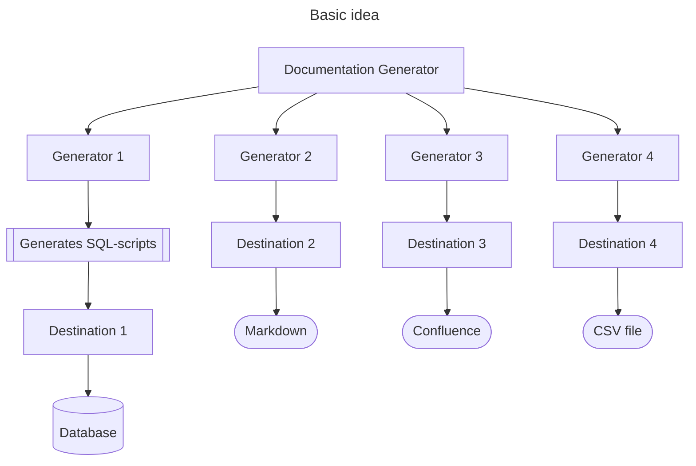

# Documentation Generator

Generates documentation based upon a yaml- or JSON-file.
Describe how your database looks, in a single file (or files) and then generate the corresponding documentation.

This document covers:
- [Idea of the documentaion generator](#idea-of-the-documentation-generator)
- [Documentation structure](#documentation-structure)
- [Destinations](#destinations)
- [Usage](#usage)
- [Documentation types](#documentation-types)
  - [Types supported](#documentation-types-supported)
- [Demos](#demos)

## Badges


---

## Idea of the Documentation Generator

The basic idea of the Documentation Generator is one place to have the model and then generate 
and distribute documentation to different places.

Each `Generator` generates something and a `Destination` can send the output to somewhere. 

Some generators are supplied in-the-box, but you're able to design your own generator and destinations.

The generators acts as plugin - Just implement `GeneratorConfiguration`.



---

## Documentation structure

The documentation file or files can be yaml- or json-files.

If you in the beginning of your file add a reference to the schema, so you IDE can validate and have code completion.

```yaml
$schema:  https://patrickfust.github.io/documentation-generator/documentation-schema.json
```

Example of a file

```yaml
$schema:  https://patrickfust.github.io/documentation-generator/documentation-schema.json
documentationTitle: My database
schemaName: theSchema
tables:
  - name: table_a
    createTableScript: create_table_a.sql
    fields:
      - name: field_a
        dataType: int
        foreignKey:
          tableName: table_b
          columnName: field_b
  - name: table_b
    fields:
      - name: field_b
        dataType: int
  - name: table_in_group
    fields:
      - name: field_b
        dataType: int
```

or as JSON:
```json
{
    "$schema": "https://patrickfust.github.io/documentation-generator/documentation-schema.json",
    "documentationTitle": "My database",
    "schemaName": "theSchema",
    "tables": [
        {
            "name": "table_a",
            "createTableScript": "create_table_a.sql",
            "fields": [
                {
                    "name": "field_a",
                    "dataType": "int",
                    "foreignKey": {
                        "tableName": "table_b",
                        "columnName": "field_b"
                    }
                }
            ]
        },
        {
            "name": "table_b",
            "fields": [
                {
                    "name": "field_b",
                    "dataType": "int"
                }
            ]
        },
        {
            "name": "table_in_group",
            "fields": [
                {
                    "name": "field_b",
                    "dataType": "int"
                }
            ]
        }
    ]
}
```

## Generator Configuration File

You can either configure your [Gradle](documentation-generator-gradle) directly, or have a configuration file.
The configuration file is the only way to use the [Maven plugin](documentation-generator-maven-plugin)

See an example in the [demo](demos/demo-erdiagram) where [generator-configuration.yml](demos/demo-erdiagram/generator-configuration.yml) is located.

The generator configuration file contains a list of configurations.
Each configuration consist of the class name of the configuration class and then it's fields.
You can have nested objects, you just have to specify which class name it is.

### Example of configuration file
```yaml
- className: dk.fust.docgen.erdiagram.ERDiagramConfiguration
  documentationFile: documentation.yaml
  umlGenerator: MERMAID
  generateKeys:
    - className: dk.fust.docgen.erdiagram.GenerateKey
      destinationKey: MODEL_MERMAID_PLACEHOLDER
    - className: dk.fust.docgen.erdiagram.GenerateKey
      destinationKey: MODEL_MERMAID_GROUP_PLACEHOLDER
      filter: my_group
  destination:
    className: dk.fust.docgen.destination.MarkdownDestination
    file: README.md
- className: dk.fust.docgen.erdiagram.ERDiagramConfiguration
  documentationFile: documentation.yaml
  umlGenerator : PLANTUML
  generateKeys:
    - className: dk.fust.docgen.erdiagram.GenerateKey
      destinationKey: MODEL_PLANTUML_PLACEHOLDER
  destination:
    className: dk.fust.docgen.destination.MarkdownDestination
    file: README.md
```

---

## Destinations

Destination is the where Documentation Generator will send the documentation.
You can implement you own if you want or use these.

### DirectoryDestination

Class name: `dk.fust.docgen.destination.DirectoryDestination`

Sends to separate files in the directory

| Setting                 | Type    | Description                                                     | Default |
|-------------------------|---------|-----------------------------------------------------------------|---------|
| directory               | File    | Where the files will be stored                                  |         |
| createParentDirectories | boolean | Should the directory's parent directories be created if missing | false   |

### FileDestination

Class name: `dk.fust.docgen.destination.FileDestination`

Replace an entire file with the document

| Setting | Type | Description                             | Default |
|---------|------|-----------------------------------------|---------|
| file    | File | Location of the file. Must be writeable |         |

### MarkdownDestination

Class name: dk.fust.docgen.destination.MarkdownDestination

| Setting | Type | Description                 | Default |
|---------|------|-----------------------------|---------|
| file    | File | Markdown file to be updated |         |  

In order for the `MarkdownDestination` being able to substitute parts of a markdown-file, 
you'll mark a start and an end placeholder, and everything in between will be substituted.

#### Markup in Markdown
For instance this shows a substitution with the key `MY_KEY`, where the beginning and end is.
Everything in between will be substituted.

```markdown
[//]: #MY_KEY_START ()
... this is replaced ...
[//]: #MY_KEY_END ()
```

### ConfluenceDestination

Class name: `dk.fust.docgen.confluence.destination.ConfluenceDestination`

In order to use Confluence as destination, you'll need to add the module: 
[documentation-generator-confluence](extensions/documentation-generator-confluence/)

| Setting             | Type   | Description             | Exanple                                 |
|---------------------|--------|-------------------------|-----------------------------------------|
| baseUrl             | String | Base URL to Confluence. | https://xxx.atlassian.net/wiki/rest/api |
| documentationPageId | String | Id of the parent page.  | 123456                                  |
| spaceKey            | String | Confluence space key    | ABC                                     |
| parentPageTitle     | String |                         | My Parent Page                          |
| pageTitle           | String |                         | My Page                                 | 

Username and personal access token for Confluence will be promptet .

---

## Usage

You can use Documentation Generator as
- [Gradle plugin](documentation-generator-gradle)
- [Maven plugin](documentation-generator-maven-plugin)

---

## Documentation types

The documentation generator support these documentation types, but you're free to create your own. 
Just implement `dk.fust.docgen.Generator` and `dk.fust.docgen.GeneratorConfiguration`.

Add a dependency in your buildscript with the corresponding artifact id.

### Documentation types supported

| Artifact id                                                                                   | Description                        |
|-----------------------------------------------------------------------------------------------|------------------------------------|
| [documentation-generator-erdiagram](generators/documentation-generator-erdiagram)             | Generates entity-relation diagrams |
| [documentation-generator-sqlscript](generators/documentation-generator-sqlscript)             | Generates SQL-files                |
| [documentation-generator-datalineage](generators/documentation-generator-datalineage)         | Generates Data lineage             |
| [documentation-generator-data-dictionary](generators/documentation-generator-data-dictionary) | Generates Data dicitionary         |

---

## Demos

In the [demos](demos) folder you can see examples on how to use the documentation generator.
