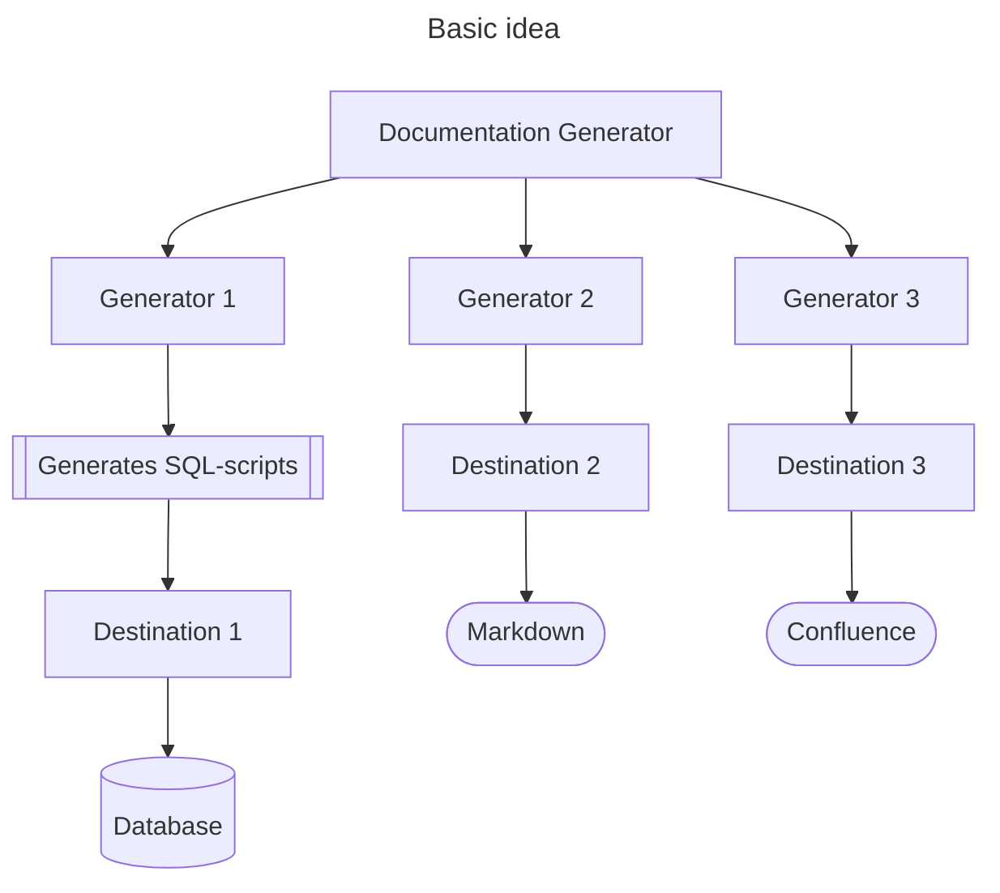

# Documentation Generator

Generates documentation based upon a yaml- or JSON-file.
Describe how your database looks, in a single file (or files) and then generate the corresponding documentation.

This document covers:
- [Idea of the documentaion generator](#idea)
- [Documentation structure](#documentation-structure)
- [Destinations](#destinations)
  - [FileDestination](#dkfustdocgendestinationfiledestination)
- [Usage in Gradle](#usage-in-gradle)
- [Documentation types](#documentation-types)
  - [Types supported](#types-supported)
- [Demos](#demos)

## Badges


---

## Idea of the Documentation Generator

The basic idea of the Documentation Generator is one place to have the model and then generate 
and distribute documentation to different places.

Each `Generator` generates something and a `Destination` can send the output to somewhere. 

Some generators are supplied in-the-box, but you're able to design your own generator and destinations.

The generators acts as plugin - Just implement `GeneratorConfiguration`.



---

## Documentation structure

The documentation file or files can be yaml- or json-files.

If you in the beginning of your file add a reference to the schema, so you IDE can validate and have code completion.

```yaml
$schema:  https://patrickfust.github.io/documentation-generator/documentation-schema.json
```

Example of a file

```yaml
$schema:  https://patrickfust.github.io/documentation-generator/documentation-schema.json
documentationTitle: My database
schemaName: theSchema
tables:
  - name: table_a
    createTableScript: create_table_a.sql
    fields:
      - name: field_a
        dataType: int
        foreignKey:
          tableName: table_b
          columnName: field_b
  - name: table_b
    fields:
      - name: field_b
        dataType: int
  - name: table_in_group
    fields:
      - name: field_b
        dataType: int
```

or as JSON:
```json
{
    "$schema": "https://patrickfust.github.io/documentation-generator/documentation-schema.json",
    "documentationTitle": "My database",
    "schemaName": "theSchema",
    "tables": [
        {
            "name": "table_a",
            "createTableScript": "create_table_a.sql",
            "fields": [
                {
                    "name": "field_a",
                    "dataType": "int",
                    "foreignKey": {
                        "tableName": "table_b",
                        "columnName": "field_b"
                    }
                }
            ]
        },
        {
            "name": "table_b",
            "fields": [
                {
                    "name": "field_b",
                    "dataType": "int"
                }
            ]
        },
        {
            "name": "table_in_group",
            "fields": [
                {
                    "name": "field_b",
                    "dataType": "int"
                }
            ]
        }
    ]
}
```

---

## Destinations

Destination is the where Documentation Generator will send the documentation.
You can implement you own if you want or use these.

### dk.fust.docgen.destination.FileDestination

Sends to separate files in the directory

| Setting                 | Type    | Description                                                     | Default |
|-------------------------|---------|-----------------------------------------------------------------|---------|
| directory               | File    | Where the files will be stored                                  |         |
| createParentDirectories | boolean | Should the directory's parent directories be created if missing | false   |

### dk.fust.docgen.destination.MarkdownDestination 

| Setting | Type | Description                 | Default |
|---------|------|-----------------------------|---------|
| file    | File | Markdown file to be updated |         |  

In order for the `MarkdownDestination` being able to substitute parts of a markdown-file, 
you'll mark a start and an end placeholder, and everything in between will be substituted.

#### Markup in Markdown
For instance this shows a substitution with the key `MY_KEY`, where the beginning and end is.
Everything in between will be substituted.

```markdown
[//]: #MY_KEY_START ()
... this is replaced ...
[//]: #MY_KEY_END ()
```


---

## Usage in Gradle

### Dependency

#### gradle.properties
Add the version of documentation-generator you want to use in `gradle.properties`.
```groovy
documentationGeneratorVersion = 0.0.5
```

#### build.gradle
Now you can add a dependency to the gradle-plugin.
```groovy
buildscript {
    dependencies {
        classpath("dk.fust:documentation-generator-gradle:${documentationGeneratorVersion}")
    }
}
```
You can instead of the variable `${documentationGeneratorVersion}` simply write the version here.

For every kind of documentation you want generated, you'll need to add the corresponding dependency in the buildscript-section.

For example: 
```
classpath("dk.fust:documentation-generator-erdiagram:${documentationGeneratorVersion}")
```

### Gradle task

```groovy
documentationGenerator {
  generatorConfigurations = [
        ... list of configurations ...
  ]
}
```

The list of configurations consists of the desired configurations.

To generate documentation, run:
```shell
gradle generateDocumentation
```


---

## Documentation types

The documentation generator support these documentation types, but you're free to create your own. 
Just implement `dk.fust.docgen.Generator` and `dk.fust.docgen.GeneratorConfiguration`.

Add a dependency in your buildscript with the corresponding artifact id.

### Documentation types supported

| Artifact id                                                            | Description                        |
|------------------------------------------------------------------------|------------------------------------|
| [documentation-generator-erdiagram](documentation-generator-erdiagram) | Generates entity-relation diagrams |
| [documentation-generator-sqlscript](documentation-generator-sqlscript) | Generates SQL-files                |

---

## Demos

In the [demos](demos) folder you can see examples on how to use the documentation generator.
